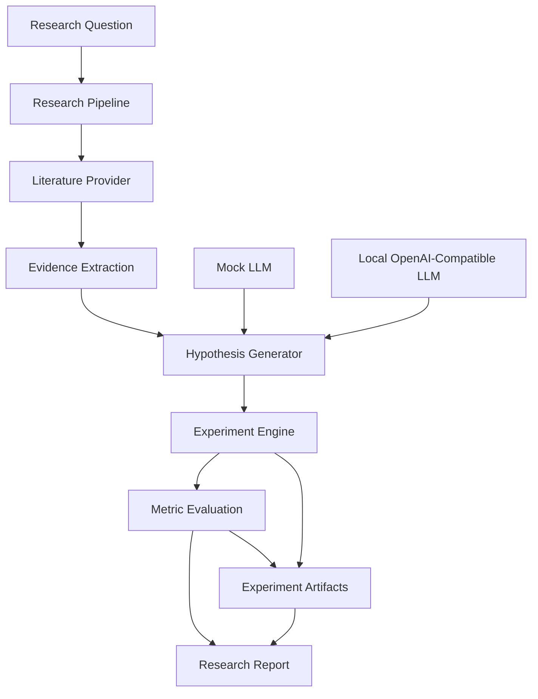

<div align="center">

# 🧬 AstraLab

### AI-Assisted Scientific Discovery & Computational Research Engine

<p>
  
  
  
  
</p>

<p>
  <b>Question → Literature → Evidence → Hypothesis → Experiment → Results → Report</b>
</p>

</div>

---

## 🔬 Overview

**AstraLab** is an AI-assisted scientific research platform designed to turn a research question into a structured, reproducible computational investigation.

Instead of functioning as a simple AI chatbot, AstraLab separates the research workflow into explicit stages:

```text
Research Question
       ↓
Literature Retrieval
       ↓
Evidence Extraction
       ↓
Hypothesis Generation
       ↓
Computational Experiment
       ↓
Metric Evaluation
       ↓
Reproducible Research Report
```

The current release is an **MVP** with deterministic mock literature and a real local computational experiment. It is intentionally structured so real literature providers, local LLMs, RAG, multi-agent orchestration, and richer research tooling can be added without replacing the core pipeline.

> **Scientific integrity:** the current mock literature is synthetic demonstration data. The included experiment uses synthetic data and demonstrates the engineering workflow; it does **not** establish a real scientific claim.

---

## ✨ Features

| Capability | Current Status |
|---|---|
| Research question pipeline | ✅ |
| Structured literature records | ✅ |
| Evidence extraction | ✅ |
| Candidate hypothesis generation | ✅ |
| Real computational experiment | ✅ |
| Baseline vs experimental comparison | ✅ |
| Reproducible random seed | ✅ |
| Experiment artifacts | ✅ |
| Automatic Markdown reports | ✅ |
| FastAPI backend | ✅ |
| Interactive research UI | ✅ |
| Mock/offline development mode | ✅ |
| OpenAI-compatible local LLM interface | ✅ |
| Real arXiv retrieval | 🧪 Available in provider layer |
| RAG / embeddings | 🔜 |
| Knowledge graph | 🔜 |
| Multi-agent research loop | 🔜 |
| Advanced experiment sandbox | 🔜 |
| Production database | 🔜 |

---

## 🧠 Architecture



### Core components

```text
app/
├── ai.py          → LLM provider abstraction
├── literature.py  → Literature provider layer
├── hypothesis.py  → Structured hypothesis generation
├── experiment.py  → Computational experiment engine
├── research.py    → End-to-end orchestration
├── report.py      → Research report generation
├── models.py      → Typed data models
└── main.py        → FastAPI + web interface
```

---

## ⚙️ Tech Stack

### Backend
- Python
- FastAPI
- Pydantic
- Uvicorn

### Scientific Computing
- NumPy
- pandas
- scikit-learn

### AI
- Mock LLM provider
- OpenAI-compatible local LLM interface
- Compatible with local inference servers such as Ollama when configured

### Research Infrastructure
- Structured evidence
- Experiment artifacts
- Reproducibility manifests
- Markdown research reports

---

# 🚀 Quick Start

## 1. Clone

```bash
git clone https://github.com/YOUR_USERNAME/AstraLab.git
cd AstraLab
```

## 2. Create a virtual environment

### Windows PowerShell

```powershell
py -m venv .venv
.\.venv\Scripts\Activate.ps1
```

### Linux / macOS

```bash
python3 -m venv .venv
source .venv/bin/activate
```

## 3. Install dependencies

```bash
python -m pip install -r requirements.txt
```

## 4. Configure

```powershell
Copy-Item .env.example .env
```

The default configuration uses mock mode, so **no API keys are required for the MVP**.

---

# ▶️ Run the Demo

Run the complete research pipeline:

```bash
python -m scripts.demo
```

Example flow:

```text
============================================================
ASTRALAB SCIENTIFIC DISCOVERY ENGINE
============================================================

Research Question:
How can machine learning improve battery performance?

[1/6] Searching literature...
[2/6] Evidence extracted
[3/6] Hypothesis generated
[4/6] Experiment created
[5/6] Experiment executed
[6/6] Report generated

RESULT

Baseline MAE:       ...
Experimental MAE:   ...
Difference:         ...
Relative improvement: ...

Report: reports/...
```

---

# 🌐 Launch the Web Interface

```bash
python -m uvicorn app.main:app --reload
```

Open:

```text
http://127.0.0.1:8000
```

The interface provides:

- Research question input
- Literature cards
- Evidence summaries
- Candidate hypotheses
- Experiment metrics
- Generated report access
- Developer JSON inspection

---

# 🧪 Experiment Engine

The MVP contains a real computational benchmark using synthetic nonlinear data.

It compares:

```text
Baseline
Linear Regression
        vs.
Experimental
Random Forest Regression
```

The experiment records:

- MAE
- baseline value
- experimental value
- absolute difference
- relative improvement
- random seed
- Python version
- experiment metadata

Artifacts are stored under:

```text
experiments/<research_id>/
├── results.json
└── manifest.json
```

### Important

The experiment demonstrates the **research-engineering workflow**.

It should not be interpreted as evidence that one algorithm is universally superior, nor as evidence about real battery systems.

---

# 🤖 Local LLM

AstraLab includes an OpenAI-compatible local LLM interface.

Configure `.env`:

```env
LLM_PROVIDER=local
LLM_BASE_URL=http://127.0.0.1:11434/v1
LLM_MODEL=qwen3:4b
LLM_API_KEY=
```

The exact model name depends on the local inference server.

The application retains:

```env
LLM_PROVIDER=mock
```

for deterministic development and testing.

This means the core application does **not** depend on a paid cloud model.

---

# 📚 Literature Providers

The project uses a provider abstraction:

```text
LiteratureProvider
├── MockLiteratureProvider
└── ArxivProvider
```

This allows additional sources to be integrated without changing the research pipeline.

The current mock records are explicitly marked:

```text
DEMO DATA
```

and use non-real example URLs.

No mock paper should be treated as a real publication.

---

# 🔌 API

## Health

```http
GET /health
```

Example:

```json
{
  "status": "ok",
  "mock_mode": true,
  "llm_provider": "mock",
  "literature_provider": "mock"
}
```

## Run Research

```http
POST /research
Content-Type: application/json
```

Request:

```json
{
  "question": "How can machine learning improve battery performance?"
}
```

The endpoint returns:

- research ID
- papers
- evidence
- hypotheses
- experiment results
- report path

## Interactive API documentation

When AstraLab is running:

```text
http://127.0.0.1:8000/docs
```

---

# 🧪 Testing

Run the complete test suite:

```bash
python -m pytest
```

The tests cover:

- Literature retrieval
- Hypothesis generation
- Experiment execution
- Complete research pipeline

Compile-check the application:

```bash
python -m compileall app scripts tests
```

---

# 📊 Evaluation

AstraLab deliberately separates **engineering evaluation** from **scientific validation**.

### Current engineering evaluation

The included benchmark measures:

```text
MAE
Baseline vs Experimental
Relative improvement
Reproducibility
```

### Scientific validation

Real scientific validation is **not yet implemented**.

A future research-grade release should add:

- real peer-reviewed literature
- citation provenance
- statistical testing
- uncertainty estimation
- domain-specific datasets
- independent replication
- human expert review
- stronger experiment isolation

---

# 🗂️ Project Structure

```text
AstraLab/
│
├── app/
│   ├── core/
│   │   ├── config.py
│   │   └── logging.py
│   │
│   ├── ai.py
│   ├── experiment.py
│   ├── hypothesis.py
│   ├── literature.py
│   ├── main.py
│   ├── models.py
│   ├── report.py
│   └── research.py
│
├── data/
├── experiments/
├── reports/
│
├── scripts/
│   └── demo.py
│
├── tests/
│   └── test_pipeline.py
│
├── .env.example
├── .gitignore
├── README.md
└── requirements.txt
```

---

# 🛡️ Safety & Scientific Integrity

AstraLab is designed around a simple principle:

```text
AI-generated hypothesis
        +
Computational evidence
        +
Reproducible experiment
        =
Candidate research result
```

Not:

```text
LLM output = scientific fact
```

The system therefore distinguishes between:

- source material
- extracted evidence
- AI-generated hypotheses
- computational observations
- interpretation
- limitations

The current experiment engine is designed for controlled computational demonstrations and should not be used to execute arbitrary system commands.

---

# 🐳 Docker

Containerization is part of the planned deployment layer.

The current MVP is optimized for direct local Python execution first. A production Docker image will be added alongside the production database, worker system, persistent storage, and stronger experiment isolation.

---

# 🗺️ Roadmap

### V0.1 — MVP
- [x] End-to-end research pipeline
- [x] Mock literature
- [x] Evidence layer
- [x] Hypothesis generation
- [x] Computational experiment
- [x] Metrics
- [x] Research report
- [x] FastAPI
- [x] Web UI

### V0.2 — Real Research
- [ ] Real arXiv integration
- [ ] Semantic Scholar integration
- [ ] Paper deduplication
- [ ] Full-text processing
- [ ] Citation provenance

### V0.3 — AI Research Layer
- [ ] Local Qwen/LLM research agent
- [ ] Structured tool calling
- [ ] RAG
- [ ] Embeddings
- [ ] Persistent research memory

### V0.4 — Multi-Agent System
- [ ] Research planner
- [ ] Literature agent
- [ ] Evidence agent
- [ ] Hypothesis agent
- [ ] Experiment agent
- [ ] Evaluation agent
- [ ] Report agent

### V0.5 — Research Infrastructure
- [ ] Knowledge graph
- [ ] Experiment registry
- [ ] Dataset registry
- [ ] Reproducibility hashing
- [ ] Advanced experiment isolation

### V1.0 — Research Platform
- [ ] Production database
- [ ] Background workers
- [ ] Advanced dashboard
- [ ] Authentication
- [ ] Production deployment
- [ ] Domain-specific scientific modules

---

# ⚠️ Current Limitations

AstraLab is currently an **MVP**, not an autonomous scientific laboratory.

Current limitations include:

- Mock literature is synthetic.
- The default experiment uses synthetic data.
- Scientific significance is not automatically established.
- Human expert review is required for real research conclusions.
- Advanced sandboxing is not yet implemented.
- Persistent production storage is not yet implemented.
- Multi-agent orchestration is planned rather than complete.

These limitations are intentionally documented rather than hidden.

---

# 📄 License

This project is released under the license included with the repository.

---

# 👨‍💻 Author

**Nihar Mandal**

BTech — Artificial Intelligence & Machine Learning

Interested in:

`AI/ML` · `LLMs` · `Agentic Systems` · `Scientific Computing` · `Software Engineering`

---

<div align="center">

### 🧬 AstraLab

**From research questions to reproducible computational experiments.**

⭐ Star the repository if you find the project interesting.

</div>
